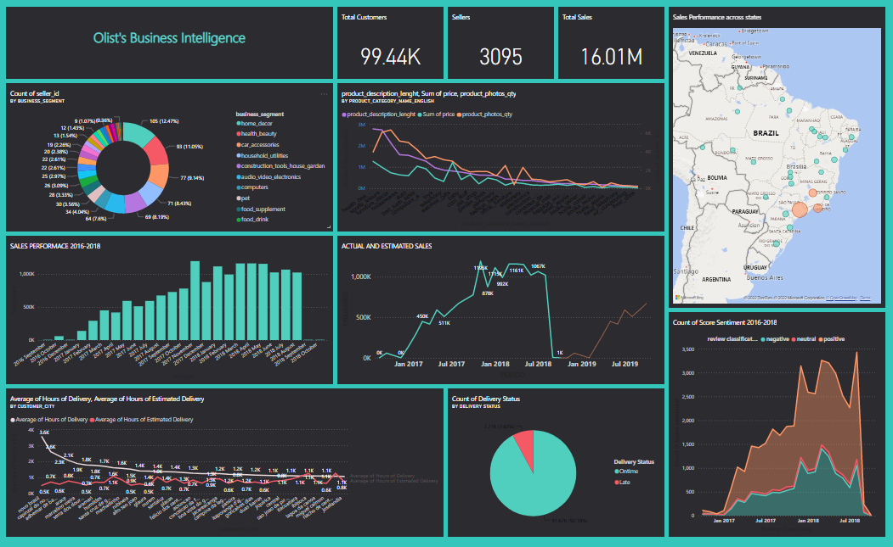

## Welcome to Megan Mai - Data Analytics Portfolio Page
Hi, it's Megan, a Data Analyst from Dublin from Generation Ireland/ UK with strong knowledge domain of Marketing and Business

Here is a place to show my projects using **Python, SQL** and **Power BI**

Please contact me via my [email](nghia.maithi@gmail.com) and [linkedin](https://www.linkedin.com/in/megan-mai/) 

## **[Python and SQL - Data Analytics and Visualizations](https://github.com/MeganMai/Data-analytics-and-visutalization-with-SQL-and-Python)**
### Language: SQL, Python (pandas, matplotlib, plotly, json)
Using SQL for data manipulation and Python (pandas, matplotlib, plotly, geojson) for Data visualization

This project contains 2 parts:

1. Transform the data in SQL Serer (SSMS)
2. Process and Visualize Data in Python

This project is working the [AdventureWorks Database](https://docs.microsoft.com/en-us/sql/samples/adventureworks-install-configure?view=sql-server-ver16&tabs=ssms) from Microsoft.

Double Bar Chart (**MatPlotLib**) showing the differences between regions

Double Donut Chart (**Plotly**) showing the differences of sales volumes and percentage between years

Map Chart (**Plotly/ Json**) showing the differences of sales volumes within the region geographically

## **[Python and Power BI/ DAX - Olist-E-commerce-Bussiness-Intelligence](https://github.com/MeganMai/Olist-E-commerce-Bussiness-Intelligence)**
### Language: Python, DAX, Power BI

Using SQL, Python and Power BI to analyze and visualize e-commerce data from Olist - the leading Brazilian e-commerce platform
There are two main parts:
1. Seller Intelligence
2. Product Atrribute
3. Sales Performance Analysis
4. Logistic Performance Analysis
5. Customer insights
6. Sentimental Analysis

This project is based on the [dataset provided by Olist](https://www.kaggle.com/datasets/olistbr/brazilian-ecommerce)

Here is the completed dashboard 

## **[Power BI - Marketing Campaign Analytics](https://github.com/MeganMai/Matketing-Campaign-Analytics)**
### Language: Power BI (DAX/ Dashboard)
Using Power Query to clean and analyse Internet Marketing Campaign of a education company and visualize the sumary using Power BI desktop and Dashboad.

Live Dashboard
<iframe title="Nghia Mai_Captone Project 1_V2_July" width="1140" height="541.25" src="https://app.powerbi.com/reportEmbed?reportId=90d0c425-e190-4abf-883e-1f08c8a98b83&autoAuth=true&ctid=41ab42a9-381b-48cf-8a85-720464922976&config=eyJjbHVzdGVyVXJsIjoiaHR0cHM6Ly93YWJpLXNvdXRoLWVhc3QtYXNpYS1iLXByaW1hcnktcmVkaXJlY3QuYW5hbHlzaXMud2luZG93cy5uZXQvIn0%3D" frameborder="0" allowFullScreen="true"></iframe>

