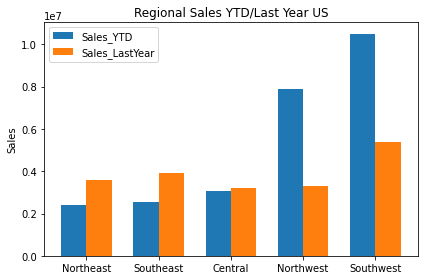
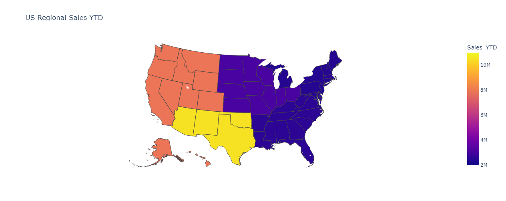
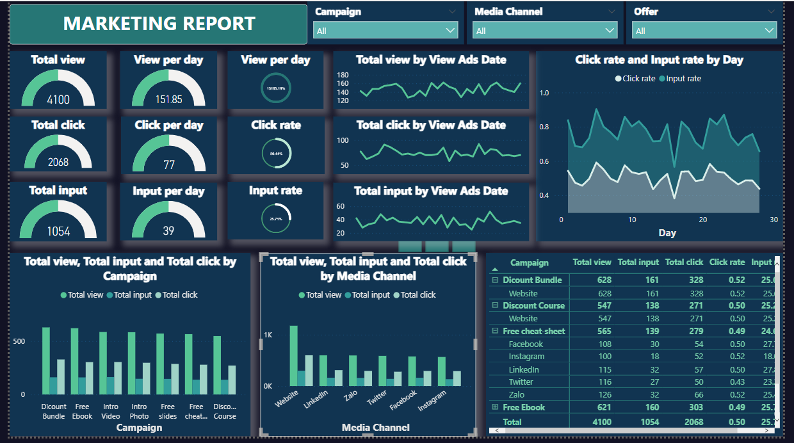

## Welcome to Megan Mai - Data Analytics Portfolio Page
Hi, it's Megan, a Data Analytics Graduate from Generation Ireland/ UK
Here is a place to show my projects using Python, SQL and Power BI

## **[Project 1 - Data Analytics and Visualizations with SQL Server and Python](https://github.com/MeganMai/Data-analytics-and-visutalization-with-SQL-and-Python)**
### Language: SQL, Python (pandas, matplotlib, plotly, json)
Analyze adventurworks data by SQL to find out regional sales data of US-the highest performing countries in sales values. 
Plot bar charts, donut charts and maps chart using matplotlib, plotly and geojson

Double Bar Chart (**MatPlotLib**) showing the differences between regions

Double Donut Chart (**Plotly**) showing the differences of sales volumes and percentage between years

Map Chart (**Plotly/ Json**) showing the differences of sales volumes within the region geographically

## **[Project 2 - Marketing Campaign Analytics with Power BI](https://github.com/MeganMai/Matketing-Campaign-Analytics)**
### Language: Power BI
Using Power Query to clean and analyse Internet Marketing Campaign of a education company and visualize the sumary using Power BI desktop and Dashboad.

Live Dashboard
<iframe title="Nghia Mai_Captone Project 1_V2_July" width="1140" height="541.25" src="https://app.powerbi.com/reportEmbed?reportId=90d0c425-e190-4abf-883e-1f08c8a98b83&autoAuth=true&ctid=41ab42a9-381b-48cf-8a85-720464922976&config=eyJjbHVzdGVyVXJsIjoiaHR0cHM6Ly93YWJpLXNvdXRoLWVhc3QtYXNpYS1iLXByaW1hcnktcmVkaXJlY3QuYW5hbHlzaXMud2luZG93cy5uZXQvIn0%3D" frameborder="0" allowFullScreen="true"></iframe>

